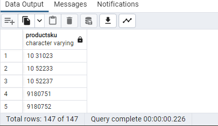

What are your risk areas? Identify and describe them.


## It is risky if there is a product in one of the tables that does not exist in the product table. This means that we have incorrect data.


QA Process:

Describe your QA process and include the SQL queries used to execute it.

## We need to check for each table that uses the product id (productsku) if there are any products that do not exist in the products table

```SQL
select distinct s.productsku  from sales_by_sku s 
where not  exists (select sku from products where s.productSKU=sku)

select distinct s.productsku  from sales_report s 
where not  exists (select sku from products where s.productSKU=sku)

select distinct s.productsku  from all_sessions s 
where not  exists (select sku from products where s.productSKU=sku)
```


## In the first two tables, she found no irregularities, while in the third table there are products that do not exist in the products table.


