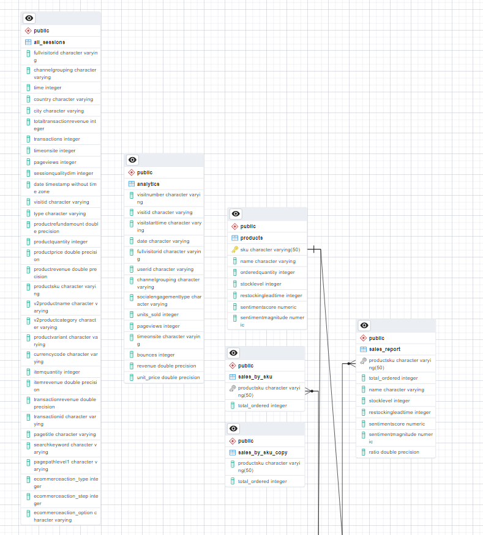

# Final-Project-Transforming-and-Analyzing-Data-with-SQL

## PROJECT/GOALS:

## -Loading csv Files into Database
## -Cleaning, transforming and analyzing data
## -Starting with Questions
## -Developing and implementing a QA process to validate transformed data against raw data

## Schema database ecommerce

## Process
### (your step 1)
### (your step 2)

## Results
(fill in what you discovered this data could tell you and how you used the data to answer those questions)

## Challenges 
(discuss challenges you faced in the project)

## Future Goals
(what would you do if you had more time?)
