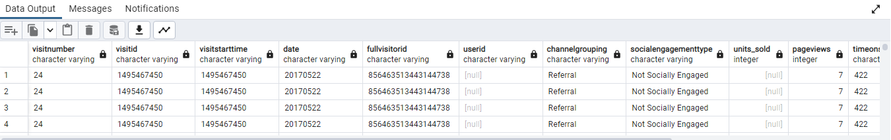

# Final-Project-Transforming-and-Analyzing-Data-with-SQL

## PROJECT/GOALS:

-Loading csv Files into Database

-Cleaning, transforming and analyzing data

-Starting with Questions

-Developing and implementing a QA process to validate transformed data against raw data

## Schema database ecommerce


## Process
### Step 1. Loading csv Files into Database
```SQL
--create table 
CREATE TABLE sales_by_sku (
  productSKU VARCHAR(50),
  total_ordered int
)
--loading csv file in tabel
COPY sales_by_sku
FROM 'C:\Users\Danijela\repo\Project1_SQL\data\sales_by_sku.csv'
WITH (FORMAT CSV, HEADER);


--create table 
CREATE TABLE sales_report (
productSKU VARCHAR(50),
total_ordered int,
name VARCHAR,
stockLevel int,
restockingLeadTime int,
sentimentScore decimal,
sentimentMagnitude decimal,
ratio double precision
)
--loading csv file in tabel
COPY sales_report
FROM 'C:\Users\Danijela\repo\Project1_SQL\data\sales_report.csv'
WITH (FORMAT CSV, HEADER);


--create table 
CREATE TABLE products (
SKU VARCHAR(50),
name VARCHAR,
orderedQuantity int,
stockLevel int,
restockingLeadTime	int,
sentimentScore decimal,
sentimentMagnitude	decimal
)
--loading csv file in tabel
COPY products
FROM 'C:\Users\Danijela\repo\Project1_SQL\data\products.csv'
WITH (FORMAT CSV, HEADER);


--create table 
CREATE TABLE analytics (
visitNumber VARCHAR,
visitId VARCHAR,
visitStartTime VARCHAR,
date VARCHAR,
fullvisitorId VARCHAR,
userid VARCHAR,
channelGrouping VARCHAR,
socialEngagementType VARCHAR,
units_sold int,
pageviews int,
timeonsite VARCHAR,
bounces int,
revenue float,
unit_price float
)
--loading csv file in tabel
COPY analytics
FROM 'C:\Users\Danijela\repo\Project1_SQL\data\analytics.csv'
WITH (FORMAT CSV, HEADER);


--create table 
CREATE TABLE all_sessions (
fullVisitorId VARCHAR,
channelGrouping VARCHAR,
time int,
country VARCHAR,
city VARCHAR,
totalTransactionRevenue int,
transactions int,
timeOnSite int,
pageviews int,
sessionQualityDim int,
date VARCHAR,
visitId VARCHAR,
type VARCHAR,
productRefundAmount float,
productQuantity int,
productPrice float,
productRevenue float,
productSKU VARCHAR,
v2ProductName VARCHAR,
v2ProductCategory VARCHAR,
productVariant VARCHAR,
currencyCode VARCHAR,
itemQuantity int,
itemRevenue float,
transactionRevenue float,
transactionId VARCHAR,
pageTitle VARCHAR,
searchKeyword VARCHAR,
pagePathLevel1 VARCHAR,
eCommerceAction_type int,
eCommerceAction_step int,
eCommerceAction_option VARCHAR
)
--loading csv file in tabel
COPY all_sessions
FROM 'C:\Users\Danijela\repo\Project1_SQL\data\all_sessions.csv'
WITH (FORMAT CSV, HEADER);

```
### Step 2. Cleaning, transforming and analyzing data

In file cleaning_data.md

### Step 3. Starting with Questions

In files starting_with_data.md and starting_with_questions.md

### Step 4.Developing a QA process

In file QA.md

## Results
(fill in what you discovered this data could tell you and how you used the data to answer those questions)

This database provides data on revenue by product as well as data on how each visitor to the site interacted with the products (when they visited, where they were based, how many pages they viewed, how long they stayed on the site, and the number of transactions they entered).

Here I found answers to some of these questions:

Which cities and countries have the highest level of transaction revenues on the site?

What is the average number of products ordered from visitors in each city and country?

How much was sold product in total?

What is the product with the most transactions?

In files starting_with_data.md and starting_with_questions.md

## Challenges 
(discuss challenges you faced in the project)

I encountered a lot of challenges within the projects.
My biggest challenge was data cleaning.

The problem is when you have tables that do not have primary and foreign keys and when you are not sure what the unique data is in the tables. 

In addition, I found that in the tables connected to the products table there are products that do not exist in the products table, which definitely means that the data is incomplete or bad.

In QA.md file

```SQL
select distinct s.productsku  from sales_by_sku s 
where not  exists (select sku from products where s.productSKU=sku)

select distinct s.productsku  from sales_report s 
where not  exists (select sku from products where s.productSKU=sku)

select distinct s.productsku  from all_sessions s 
where not  exists (select sku from products where s.productSKU=sku)
```


I also found it in the table eg. for visitid='1495467450' 44 rows with identical rows except for the UNIT_PRICE column. That's why I can't say with certainty that they are duplicates, even though the data doesn't make sense at first glance.

```SQL
select * from analytics where visitid='1495467450'
```



## Future Goals
(what would you do if you had more time?)

If I had more time, I would definitely devote more time to cleaning the data (not set data,null values...), as well as expand the part about checking the data in the QA process.