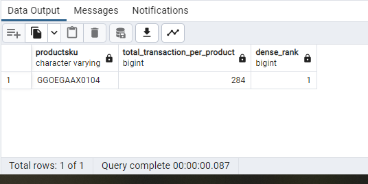

## Question 1: How much was sold product in total?

SQL Queries:
```SQL
SELECT  SUM(total_ordered) AS total_sold_products
FROM all_sessions a
JOIN products  p on a.productsku=p.sku
JOIN sales_by_sku s on s.productsku=p.sku
where country != '(not set)' and city != '(not set)'
```

Answer: 


## Question 2: What is the product with the most transactions

SQL Queries:
```SQL
select productsku,count(transactions) as total_transaction_per_product,
DENSE_RANK() OVER(order by count(transactions) desc)
from all_sessions
group by productsku
limit 1
```

Answer:



## Question 3: Find the total number of unique visitors (`fullVisitorID`)

SQL Queries:
```SQL
select fullVisitorID from all_sessions 
group by fullVisitorID
having count(fullVisitorID)=1
```
Answer:


