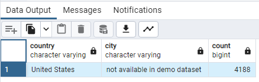
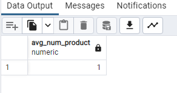
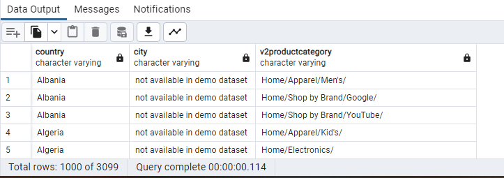
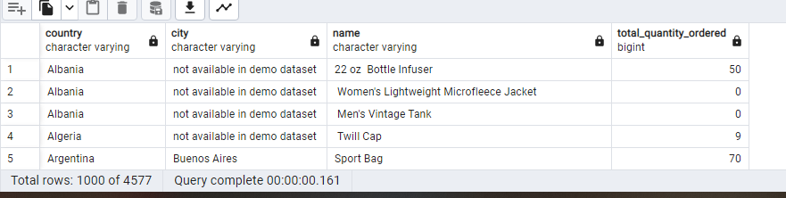

Answer the following questions and provide the SQL queries used to find the answer.

    
**Question 1: Which cities and countries have the highest level of transaction revenues on the site?**


SQL Queries:
```SQL
select country, city, count(transactions) 
from all_sessions
group by country, city
order by count(transactions) desc
limit 1

```


Answer:




"country" "city"	"count"
"United States"	"not available in demo dataset"	4188


**Question 2: What is the average number of products ordered from visitors in each city and country?**


SQL Queries:

```SQL
select distinct country, city, round(avg(nb_product) over (order by visitid),0) as avg_num_product
from (select country, city,visitid, count(productsku) as nb_product 
      from all_sessions
      group by country, city,visitid) tmp
```

Answer:




**Question 3: Is there any pattern in the types (product categories) of products ordered from visitors in each city and country?**


SQL Queries:
```SQL
select country, city, v2productcategory 
from all_sessions
where country != '(not set)' and city != '(not set)'
group by country, city, v2productcategory
order by country, city, v2productcategory
```


Answer:




**Question 4: What is the top-selling product from each city/country? Can we find any pattern worthy of noting in the products sold?**


SQL Queries:
```SQL
SELECT  country,city,p.name, SUM(total_ordered) AS total_quantity_ordered
FROM all_sessions a
JOIN products  p on a.productsku=p.sku
JOIN sales_by_sku s on s.productsku=p.sku
where country != '(not set)' or city != '(not set)'
group by country,city, name
order by country,city,total_quantity_ordered desc
```


Answer:




**Question 5: Can we summarize the impact of revenue generated from each city/country?**

SQL Queries:
```SQL
SELECT country,city,SUM(productrevenue) AS total_productrevenue
FROM all_sessions a
JOIN products  p on a.productsku=p.sku
JOIN sales_by_sku s on s.productsku=p.sku
where country != '(not set)' and city != '(not set)'
group by country,city
order by country,city,total_productrevenue desc
```


Answer:


